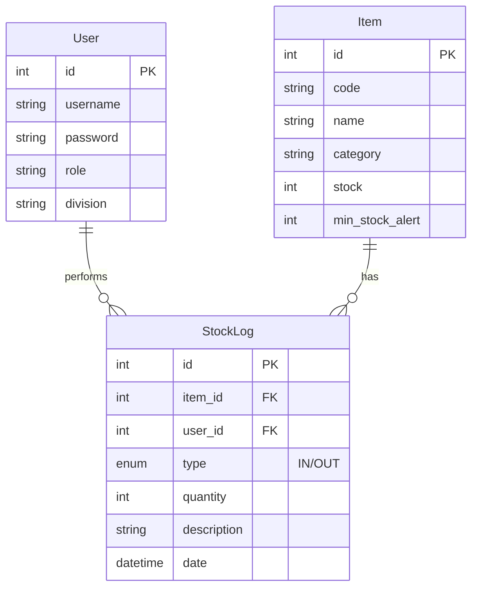

# Inventory Management System Design Document

## 1. System Architecture

**Type:** Monolithic Client-Server (Monorepo)
- **Frontend:** Single Page Application (SPA) using React.
- **Backend:** RESTful API using Node.js & Express.
- **Database:** Relational Database (SQL).
- **Authentication:** JWT (JSON Web Tokens) for stateless auth.

### High-Level Diagram
```
[User Device (Mobile/Desktop)]
       |
   HTTP/HTTPS
       |
[Web Server (Vite/Nginx)] --> [Frontend (React + Tailwind)]
       |
    REST API
       |
[Backend Server (Node/Express)]
       |
   Prisma ORM
       |
[Relational Database (SQLite/PostgreSQL)]
```

---

## 2. Database Schema (ERD)

Using a Relational model as requested.

### Entities

#### `User`
- **id** (PK): Integer/UUID
- **username**: String (Unique)
- **password**: String (Hashed)
- **full_name**: String
- **role**: Enum ('ADMIN', 'EMPLOYEE')
- **division**: String
- **created_at**: DateTime

#### `Item`
- **id** (PK): Integer/UUID
- **code**: String (Unique, Barcode/SKU)
- **name**: String
- **category**: String
- **unit**: String (e.g., pcs, pack, kg)
- **stock**: Integer (Default: 0, cannot be < 0)
- **min_stock_alert**: Integer (Threshold for low stock warning)
- **created_at**: DateTime
- **updated_at**: DateTime

#### `StockLog` (Transactions)
- **id** (PK): Integer/UUID
- **item_id** (FK): Relation to Item
- **user_id** (FK): Relation to User (Who performed the action)
- **type**: Enum ('IN', 'OUT')
- **quantity**: Integer (Positive value)
- **date**: DateTime (Default: Now)
- **description**: String (Optional note, e.g., "PO-123" or "Project X")

### ER Diagram (Mermaid)


---

## 3. User Workflows

### A. Barang Masuk (Admin Only)
1. Admin logs in.
2. Navigates to "Incoming Goods" (Barang Masuk) page.
3. Selects an existing Item (search by code/name) OR creates a new Item.
4. Enters quantity to add.
5. Enters optional description (e.g., Supplier info).
6. Submits.
7. **System:**
   - Updates `Item.stock` = `Item.stock` + `quantity`.
   - Creates a `StockLog` with type 'IN'.
   - Returns success message.

### B. Barang Keluar (Employee/Admin)
1. User logs in.
2. Navigates to "Take Items" (Ambil Barang) page.
3. Searches for Item.
4. Enters quantity to take.
5. Enters description (e.g., "For Project A").
6. Submits.
7. **System:**
   - Checks if `Item.stock` >= `quantity`.
   - If yes:
     - Updates `Item.stock` = `Item.stock` - `quantity`.
     - Creates a `StockLog` with type 'OUT'.
     - Returns success.
   - If no: Returns error "Insufficient Stock".

---

## 4. Tech Stack Recommendations

### Frontend
- **Framework:** React (Vite)
- **Language:** TypeScript
- **Styling:** Tailwind CSS v4 (Mobile First)
- **State Management:** TanStack Query (React Query) for server state.
- **UI Components:** Headless UI / Radix UI + Lucide Icons.
- **Charts:** Recharts.

### Backend
- **Runtime:** Node.js
- **Framework:** Express.js
- **Language:** TypeScript
- **ORM:** Prisma (Excellent type safety and migration flow).
- **Database:** SQLite (for standalone file-based simplicity) or PostgreSQL (for production scalability). *Recommendation: Start with SQLite for easiest deployment, switch to Postgres if needed.*
- **Auth:** jsonwebtoken (JWT) + bcryptjs.

---

## 5. Main API Endpoints

### Auth
- `POST /api/auth/login` -> `{ token, user }`
- `POST /api/auth/register` (Admin only initial setup)

### Items
- `GET /api/items` (List all, with pagination/search)
- `GET /api/items/:id` (Detail)
- `POST /api/items` (Create - Admin)
- `PUT /api/items/:id` (Update - Admin)
- `DELETE /api/items/:id` (Delete - Admin)

### Transactions
- `POST /api/transactions/in` (Record incoming - Admin)
    - Body: `{ itemId, quantity, description }`
- `POST /api/transactions/out` (Record outgoing - Auth User)
    - Body: `{ itemId, quantity, description }`
- `GET /api/transactions` (History logs - Admin sees all, Employee sees own)

### Dashboard
- `GET /api/dashboard/stats`
    - Returns: `{ totalItems, lowStockCount, totalTransactionsToday }`

---

## 6. Main Page UI Description (Dashboard)

**Layout:**
- **Sidebar:** Navigation (Dashboard, Inventory, Transactions, Reports, Settings, Logout). Collapsible on mobile.
- **Top Bar:** User profile info, Notification bell.

**Content Area:**
1.  **Summary Cards (Top Row):**
    -   **Total Items:** Large number (e.g., "1,234").
    -   **Low Stock Alert:** Red card showing number of items below minimum threshold (e.g., "5 Items needs reorder").
    -   **Today's Activity:** Count of IN/OUT transactions today.

2.  **Quick Actions (Middle Row):**
    -   Large Buttons: "Record Incoming" (Green), "Take Item" (Orange).

3.  **Recent Activity Table (Bottom):**
    -   Columns: Date, User, Type (Badge IN/OUT), Item Name, Qty.
    -   Shows last 5-10 transactions.

4.  **Stock Trends Chart (Optional):**
    -   Line chart showing stock movement over the last 7 days for top items.
